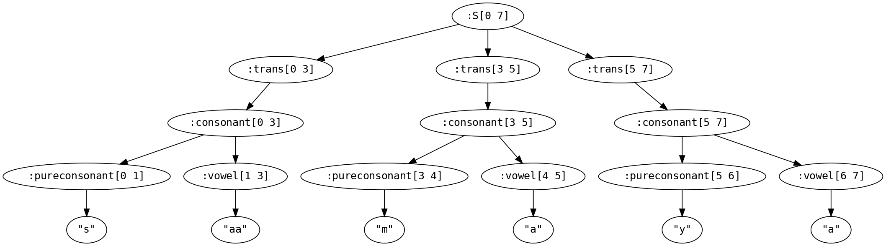
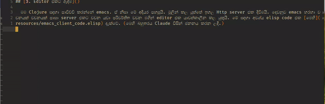

# සිංහල ටයිපින්

Clojure ගැන සිංහලෙන් ටිකක් ලියන්නට බලාපොරොත්තු වන නිසා ඊට කලින් එක උවමනාවක් ඇත. මම සාමාන්යයෙන් සිංහල ටයිප් කරන්නේ Google input tools Chrome extension එක යොදාගෙනයි. ඒත් මට මගේ IDE එක තුලම සිටිමින් සිංහල ටයිප් කිරීමට හැකිනම් එය වඩා වේගවත්ය. මේ ඒ වෙනුවෙන් උත්සාහයකි. මෙහි භාෂා පෙරලීම Clojure යොදාගෙන කලත්, ඉහල ලෙවල් එකකින් මිස මුල සිට අගට විස්තර කිරීමට තැත් නොකරන්නේ එය කිරීමට පෙර සිංහල ටයිප් කිරීම හදාගැනීම මෙහි අරමුණ නිසාය :D

## [1. ඉංග්රීසි සිංහල පරිවර්තනය (transliteration)]()

  මේ වෙනුවෙන් පාවිච්චි කල සිංහල භාෂාව සම්බන්ධ මූලාශ්ර පහල:

  [Guide to creating Sinhala and Tamil Unicode fonts](https://www.icta.lk/icta-assets/uploads/2016/01/1090_Guide%20to%20creating%20Sinhala%20and%20Tamil%20Unicode%20fonts.pdf)

  [UTF-8 encoding table and Unicode characters](https://utf8-chartable.de/unicode-utf8-table.pl?start=3456&names=2&utf8=dec)


  අපි [instaparse](https://github.com/Engelberg/instaparse) ලයිබ්රරිය පාවිච්චි කරනවා parser එකක් හදාගන්න. ඇත්තටම parser එකක් අවශ්ය නැහැ මේ වැඩේට. මේක සරල ආදේශනයක් ඇසුරෙන් කරන්න පුළුවන්. නමුත් parser එකක් භාවිතා කර මුලින් වැඩේ පටන් ගන්න පහසුයි. පසුවට වෙනත් ප්රයෝජන සහිතයි. අපේ parser ව්යාකරණය මේ ආකාරයි:

  ```
  S=(whitespace* word? whitespace*)*;

  word=(vowel|pureconsonant|consonant)+

  vowel='e'|'E'|'a'|'U'|'O'|'i'|'u'|'A'|'I'|'o'|'ee'|'aa'|'ii'|'ei'|'AA'|'ou'|'au'|'sru'|'srU';

  pureconsonant='T'|'d'|'n'|'K'|'z'|'w'|'s'|'f'|'L'|'p'|'j'|'G'|'J'|'v'|'H'|'B'|'P'|'t'|'k'|'b'|'r'|'y'|'g'|'l'|'N'|'h'|'m'|'D'|'dh'|'ch'|'Dh'|'xd'|'xj'|'Sh'|'xb'|'sh'|'xg'|'Ch'|'Th'|'th'|'thh'|'xmb'|'chh'|'xdh'|'xgdh'|'xkdh';

  consonant=pureconsonant,vowel;

  whitespace=#'(\s|\n|\t)+';
  ```

  මේ ව්යාකරණය 100%ක් නිවැරදි වීම හෝ සර්ව සම්පූර්ණ වීම අනවශ්යයි.

  උඩ දක්වලා තියෙන්නෙ ඉංග්රීසි අකුරු දාමයක් සිංහල අක්ෂර වෙත පරිවර්තනය විය හැකි විදිහ. උදාහරණයකට ඉහත ව්යාකරණයට අනුව saamaya යන ඉංග්රීසි අකුරු දාමය පහත ආකාරයෙ parse tree එකක් ජනනය කරයි: 

  ඉතුරු වී ඇත්තේ ඔය parse-tree එක සිංහල අකුරු බවට පෙරලීමයි. එය පහත mapping එකට අනුව instaparse යොදාගෙන කල හැකිය:

  ```clojure
    {:pureconsonant #(if (string? %) ((:pureconsonant-mapping transliterator) %) %)
     :vowel #(if (string? %) ((:vowel-mapping transliterator) %) %)
     :consonant (fn [pureconsonant vowel]
                 (when (and (string? pureconsonant) (string? vowel))
                  (combine pureconsonant vowel)))
     :trans str
     :whitespace identity
     :S str}
  ```


  මේ පරිවර්තකය අඩුපාඩු සහිතය. උදාහරණයකට එයට "saamaya" -> සාමය ලෙසට පෙරලිය හැකිය. එහෙත් "saamaya." යන්න පෙරලිය නොහැකිය. නමුත් දැනට අපි මේ ආකාරයේ අඩුපාඩු නොසලකා හරිමු. මේ අදියර සම්බන්ධ code සඳහා බලන්න: [transliteration.clj](src/dumrat/sin/transliteration.clj)

## [2. පරිවර්තනය සර්විස් එකක් විදිහට]()

### [2.1 Http server]()

  ඉහත මධ්යය යොදාගෙන කල සරල පරිවර්තක http server එකක් [http_server.clj](src/dumrat/sin/http_server.clj) බලාගත හැකිය. අපි කිසිදු සම්මත විධික්රම ගැන නොසලකා හුදෙක් ඇතුල් කෙරෙන ඉංග්රීසි අකුරු දාමය පෙරලීමෙන් පසුව නැවත හරවා යවමු. එපමණයි. Server එක අරඹන හැටි සඳහා උදාහරණයක් [core.clj](src/dumrat/sin/core.clj)හි බලාගත හැකිය.

### [2.2 Socket server]()

 Http server එක හරහා යාම පොඩි පමාවක් සහිතයි. දැනට මෙය 20ms පරාසයේ නිසා ලොකු ගැටළුවක් නැත. එහෙත් ඇත්ත පරිවර්තනයට ගත වන්නේ 500μS පරාසයේ කාලයකි. Socket server එකක් යොදා අපිට මේ පමාව අවම කර ගත හැකිය. ඉදිරියට...

## [3. Editor එකට ඈඳීම]()

  මම Clojure සඳහා පාවිච්චි කරන්නේ spacemacs IDE එකයි. ඒ නිසා මේ අදියර පහසුයි. මුලින් කල යුත්තේ ඉහල Http server එක දිවීමයි. දෙවනුව emacs හරහා වචනයක් වචනයක් පාසා server එකට වචන යවා පරිවර්තිත වචන මගින් editor එක යාවත්කාලීන කල යුතුයි. මේ සඳහා අවශ්ය elisp code එක [මෙහි](resources/emacs_client_code.elisp) දැක්වේ. (මෙහි බහුතරය Claude විසින් ජනනය කරන ලදී.)

දැන් මට ඉංග්රීසි ටයිප් කර සිංහලට පරිවර්තනය මගේ IDE එක තුලම කල හැකියි. මේ මුළු ලිපිය ටයිප් කලේ එසේයි.



## [4. ඉදිරිය]()

  අවශ්ය නම් වැඩිදියුණු කිරීමට බොහෝ දේ මෙහි ඇත.

  1. විරාම සලකුණු සහ අනෙක් සියළු නාඳුනන සංකේත ඉතිරි කරමින් පරිවර්තනය කල යුතුයි.
  2. Socket server එකට මාරු විය යුතුයි.
  3. පරිවර්තක නීති වඩා පුළුල් කල යුතුයි.
  4. පරිවර්තක නීති සාදාරණ key map එකක් ලෙස ඇතුල් කර නව පරිවර්තකයක් ලබා ගැනීමට හැකියාව ලබා දිය යුතුයි.
  5. තවත්...

  නමුත් මෙය මගේ උවමනාව වෙනුවෙන් හදාගන්නා දෙයක් නිසා 1 සහ 2 පමණක් කිරීමට බලාපොරොත්තු වෙමි.
